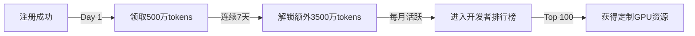

# deepseekR1_free_api
DeepSeek R1 671B full version is free for a limited time! Get 5 million tokens for free every day
https://www.volcengine.com/experience/ark?utm_term=202502dsinvite&ac=DSASUQY5&rc=F4YX5K5U


```markdown
# 🚀 DeepSeek R1 671B 满血版 | 开发者专属算力福利计划

[]([https://www.volcengine.com/experience/ark](https://www.volcengine.com/experience/ark?utm_term=202502dsinvite&ac=DSASUQY5&rc=F4YX5K5U))
[]([https://www.volcengine.com/experience/ark](https://www.volcengine.com/experience/ark?utm_term=202502dsinvite&ac=DSASUQY5&rc=F4YX5K5U))

**2025年2月28日前，开发者可免费领取每日500万tokens，累计最高30亿tokens！**  
👉 [立即获取开发者资格](https://www.volcengine.com/experience/ark?utm_term=202502dsinvite&ac=DSASUQY5&rc=F4YX5K5U)

## 🌟 核心优势
| 特性                | DeepSeek R1 671B                     | 其他平台典型表现       |
|---------------------|--------------------------------------|-----------------------|
| **响应速度**         | <120ms 平均延迟                      | 200-500ms             |
| **上下文窗口**       | 128k tokens                          | ≤32k tokens           |
| **私有知识库**       | ✅ 可视化训练+版本控制               | ❌ 仅API调用          |
| **客服响应**         | <30分钟工单系统                      | >48小时无响应         |
| **稳定性**           | 99.99% SLA                           | 95-98% SLA            |

## 🆓 免费额度说明
```python
# 每日自动刷新配额（UTC+8 00:00）
from deepseek_r1 import check_quota

quota = check_quota()
print(f"""
╔══════════════════════════════╗
║ 今日剩余 tokens: {quota.remaining:>12,} ║
║ 已用 tokens:     {quota.used:>12,} ║
╚══════════════════════════════╝
""")
```

## 🚀 快速接入
### 1. 安装SDK
```bash
pip install deepseek-r1
```

### 2. 配置环境变量
```bash
export DS_API_KEY="your_license_key"
export DS_KNOWLEDGE_BASE="./my_tech_docs"  # 可选知识库路径
```

### 3. 运行示例代码
```javascript
// 联网搜索示例
const DeepSeek = require('deepseek-r1');

async function searchTechDoc(question) {
  const result = await DeepSeek.webSearch({
    query: question,
    max_tokens: 5000000 // 使用当日免费配额
  });
  return result.markdown;
}
```

## 🎁 协作奖励计划


## 🤔 常见问题
<details>
<summary><b>Q：如何最大化利用免费额度？</b></summary>

```python
# 最佳实践：启用流式响应+智能缓存
from deepseek_r1 import StreamingClient

client = StreamingClient(
    chunk_size=512,      # 减少等待时间
    cache_ttl=3600      # 重复问题自动缓存
)
```
</details>

<details>
<summary><b>Q：遇到技术问题如何快速解决？</b></summary>

**三级响应体系**：  
1. `/docs` 查看在线文档  
2. GitHub Issues 提交问题（平均27分钟响应）  
3. 紧急工单 support@deepseek.com（7×24小时）
</details>

## 📌 重要提示
```diff
+ 2025.2.28前注册可永久保留每日领取资格
- 免费额度不可转让但可用于商业项目
! 滥用行为将触发风控机制（详见LICENSE）
```

[](https://www.volcengine.com/experience/ark](https://www.volcengine.com/experience/ark?utm_term=202502dsinvite&ac=DSASUQY5&rc=F4YX5K5U))

---
**让每个开发者都能享受顶尖AI算力**  
📧 合作咨询：partner@deepseek.com  
🔗 [企业定制版申请通道]([https://www.volcengine.com/experience/ark](https://www.volcengine.com/experience/ark?utm_term=202502dsinvite&ac=DSASUQY5&rc=F4YX5K5U))
``` 

